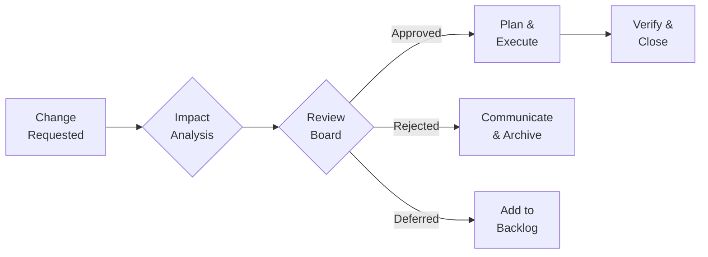

# Change Management

> Principles for handling changes to scope, schedule, or requirements in a controlled way.

---

## When to Use

- New feature request mid-project
- Scope change during sprint
- Requirement modification after sign-off
- Schedule or resource changes
- Technology or architecture pivots

---

## Core Principle

> **All changes are welcome; uncontrolled changes are not.** Assess impact before committing.

---

## Change Request Template

```markdown
## Change Request — CR-[NNN]

| Field        | Value                                                     |
| ------------ | --------------------------------------------------------- |
| Requested By | @name                                                     |
| Date         | [date]                                                    |
| Priority     | Critical / High / Medium / Low                            |
| Status       | Submitted / Under Review / Approved / Rejected / Deferred |

### Description

[What is being requested and why]

### Business Justification

[Why this change is needed — business value, risk of not doing it]

### Impact Analysis

| Dimension | Current              | After Change     | Delta     |
| --------- | -------------------- | ---------------- | --------- |
| Scope     | [X features]         | [X+N features]   | +N        |
| Schedule  | [date]               | [new date]       | +[N] days |
| Effort    | [X pts]              | [X+N pts]        | +N pts    |
| Cost      | [if applicable]      | [if applicable]  | [delta]   |
| Risk      | [current risk level] | [new risk level] | [change]  |

### Dependencies

- [affected systems, teams, or deliverables]

### Alternatives Considered

1. [Alternative 1] — [why not chosen]
2. [Alternative 2] — [why not chosen]

### Decision

| Approver | Decision                                | Date   |
| -------- | --------------------------------------- | ------ |
| @name    | ✅ Approved / ❌ Rejected / ⏸️ Deferred | [date] |

### Reason

[Rationale for the decision]
```

---

## Impact Analysis Checklist

Before approving any change, assess:

- [ ] **Scope:** What new work is added? What can be de-scoped?
- [ ] **Schedule:** Does this shift the timeline? By how much?
- [ ] **Quality:** Does this introduce technical debt?
- [ ] **Risk:** New risks introduced? Existing risks amplified?
- [ ] **Dependencies:** Does this affect other teams or systems?
- [ ] **Cost:** Additional resources or tools needed?

---

## Change Control Process



### Approval Authority

| Change Size       | Approver           |
| ----------------- | ------------------ |
| Trivial (< 2 pts) | Product Owner      |
| Small (2-8 pts)   | PM + PO            |
| Medium (8-21 pts) | Steering committee |
| Large (> 21 pts)  | Sponsor            |

---

## Change Log

Track all changes across the project:

```markdown
| CR#    | Description       | Requested | Impact |   Status    | Decision Date |
| ------ | ----------------- | --------- | :----: | :---------: | :-----------: |
| CR-001 | Add OAuth support | @user     | 🟡 +5d | ✅ Approved |  2024-01-15   |
| CR-002 | Switch database   | @arch     | 🔴 +3w | ❌ Rejected |  2024-01-20   |
```

---

## Anti-Patterns

- ❌ Accepting changes without impact analysis
- ❌ No change log (invisible scope creep)
- ❌ Every change goes to steering (bottleneck)
- ❌ Saying "yes" to everything (scope explosion)
- ❌ Rejecting everything (rigidity kills projects too)
