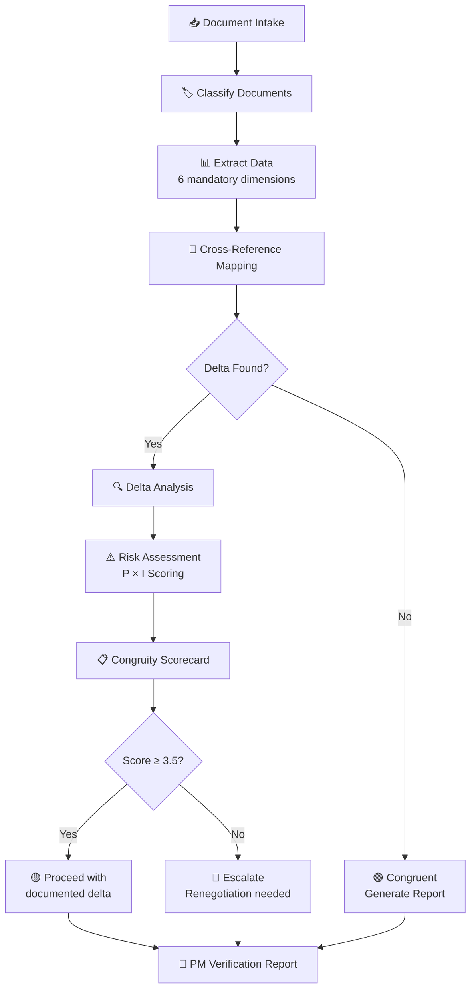

# Contract Review — Proposal vs Contract Consistency Check

> Structured methodology to compare pre-contractual documents (technical proposal, attachments) with the signed contract (Purchase Order, master agreement), identify deltas, and assess risks.

---

## When to Use

- Receipt of a new Purchase Order (PO) to compare with the proposal
- Project Kickoff — verify that the contract reflects what was proposed
- Mid-project — doubts about scope, rates, SLAs, or contractual conditions
- Internal PM audit — periodic check of document consistency
- Renewal/extension — comparison between the new contract and previous conditions

---

## 1. Document Intake & Classification

### Step 1.1: Classify Documents

For each provided document, classify it into one of the following categories:

| Category               | Abbreviation | Examples                                                   |
| ---------------------- | :----------: | ---------------------------------------------------------- |
| **Technical Proposal** |     `TP`     | Technical proposal, HO\_\*, professional services proposal |
| **Technical Annex**    |     `TA`     | Technical specifications, AT\_\*, SOW, technical annexes   |
| **Purchase Order**     |     `PO`     | Purchase Order, signed contract, order letter              |
| **Master Agreement**   |     `MA`     | Master Service Agreement, framework agreement              |
| **SLA/Penalties**      |    `SLA`     | Service Level Agreement, penalties annex                   |
| **Other**              |    `OTH`     | Amendment, addendum, side letter, meeting minutes          |

### Step 1.2: Document Intake Log

```markdown
## Document Intake — [Project/Code]

| #   | Document  | Type | Pages | Date   | Notes   |
| --- | --------- | :--: | :---: | ------ | ------- |
| 1   | [file name] |  TP  |  [n]  | [date] | [notes] |
| 2   | [file name] |  TA  |  [n]  | [date] | [notes] |
| 3   | [file name] |  PO  |  [n]  | [date] | [notes] |
```

---

## 2. Data Extraction Framework

### Extraction Dimensions (Mandatory)

For **each document**, extract the following structured data:

#### 2.1 Contractual Registry

| Field                      | Value                     |
| -------------------------- | ------------------------- |
| Contracting parties        | [client / supplier]       |
| Project/Order code         | [code]                    |
| Proposal reference         | [number/date]             |
| Signing/Execution date     | [date]                    |
| Contract duration          | [start → end]             |
| Possible renewal/extension | [conditions]              |

#### 2.2 Services Scope

```markdown
| #   | Activity/Deliverable | Description   |     Priority      |
| --- | -------------------- | ------------- | :---------------: |
| 1   | [activity]           | [description] | Must/Should/Could |
```

#### 2.3 Economic Dimension

```markdown
| Item                          | Amount | Unit            | Notes                        |
| ----------------------------- | ------ | --------------- | ---------------------------- |
| Total amount                  | €[X]   | -               | VAT excluded/included        |
| Daily rate [profile]          | €[X]   | MD (Man Days)   | [notes]                      |
| Total Man Days (MD)           | [N]    | MD              | [per profile if available]   |
| Infrastructure/license costs  | €[X]   | flat rate/usage | [notes]                      |
```

#### 2.4 Professional Figures

```markdown
| Profile | Seniority   | MD Rate | Expected MD | Notes   |
| ------- | ----------- | :-----: | :---------: | ------- |
| [role]  | [Jr/Mid/Sr] |  €[X]   |     [N]     | [notes] |
```

#### 2.5 Timelines and Milestones

```markdown
| Milestone   | Expected Date | Associated Deliverable | Penalty |
| ----------- | :-----------: | ---------------------- | :-----: |
| [milestone] |    [date]     | [deliverable]          | Yes/No  |
```

#### 2.6 SLAs, Penalties, and Conditions

```markdown
| Type          | Description | Threshold   | Penalty/Consequence |
| ------------- | ----------- | ----------- | ------------------- |
| Operative SLA | [desc]      | [threshold] | [penalty]           |
| Delay penalty | [desc]      | [threshold] | [penalty]           |
| Warranty      | [desc]      | [duration]  | [conditions]        |
```

### Extraction Dimensions (Optional — if present in documents)

Extract **only if mentioned** in the documents:

| Dimension                       | What to look for                                  |
| ------------------------------- | ------------------------------------------------- |
| **Intellectual Property**       | IP ownership, rights transfer, licenses           |
| **Confidentiality / NDA**       | Confidentiality obligations, duration, perimeter  |
| **Subcontracting**              | Constraints on third parties, necessary approvals |
| **Early termination**           | Conditions, penalties, notice period              |
| **Renewal / Extension**         | Automatic conditions, tacit renewal               |
| **Competent court**             | Jurisdiction, arbitration                         |
| **Insurances**                  | Required policies, maximum limits                 |
| **Compliance / Certifications** | ISO, GDPR, regulatory requirements                |

---

## 3. Cross-Reference Mapping

### Step 3.1: Correspondence Matrix

Create a matrix that maps sections/clauses between documents:

```markdown
## Correspondence Matrix

| #   | Theme          | Proposal Ref (TP) | Annex Ref (TA) | Contract Ref (PO) | Aligned?   |
| --- | -------------- | ----------------- | -------------- | ----------------- | :--------: |
| 1   | Services scope | TP §3.1           | TA §2          | PO Art.1          |  ✅/⚠️/❌  |
| 2   | Total amount   | TP §5             | -              | PO Art.3          |  ✅/⚠️/❌  |
| 3   | Rates          | TP §5.2           | TA §4          | PO Annex B        |  ✅/⚠️/❌  |
| 4   | Duration       | TP §2             | -              | PO Art.2          |  ✅/⚠️/❌  |
| 5   | SLAs/Penalties | TP §7             | TA §6          | PO Art.5          |  ✅/⚠️/❌  |
```

**Alignment Legend:**

- ✅ = Perfectly aligned — no delta
- ⚠️ = Minor delta — difference in phrasing but same substance
- ❌ = Significant delta — content discrepancy, even partial

---

## 4. Delta Analysis

### Step 4.1: Delta Identification

For every ❌ and ⚠️ from the correspondence matrix, fill out:

```markdown
## Delta Analysis — [Project]

| ID  | Area   | Proposal says... | Contract says... |        Delta Type        | Impact |
| --- | ------ | ---------------- | ---------------- | :----------------------: | :----: |
| D1  | [area] | [text/value]     | [text/value]     | Omission/Modification/Add | 🟢🟡🔴 |
```

### Delta Types

| Type             | Definition                                      | Example                                     |
| ---------------- | ----------------------------------------------- | ------------------------------------------- |
| **Omission**     | Present in proposal but missing in contract     | Proposed activity not included in PO        |
| **Modification** | Present in both but with different values       | Different rate, reduced scope               |
| **Addition**     | Absent in proposal but present in contract      | Unforeseen penalty clause                   |
| **Ambiguity**    | Vague phrasing or open to interpretation        | "On-site support" without defined frequency |
| **Conflict**     | Direct contradiction between documents          | Duration 6 months vs 12 months              |

---

## 5. Risk Assessment

> **Integrate with:** `risk-management` skill (Probability × Impact Matrix)

### Step 5.1: Risk Scoring for each Delta

For each significant delta (D1, D2, ...):

```markdown
## Risk Register — Contract Review [Project]

| ID  | Delta Ref | Risk               | Cat.  | Prob. (1-5) | Impact (1-5) | Score | Strategy                       | Mitigation | Owner |
| --- | :-------: | ------------------ | ----- | :---------: | :----------: | :---: | ------------------------------ | ---------- | ----- |
| R1  |    D1     | [risk description] | Scope |     [P]     |     [I]      | [PxI] | Avoid/Mitigate/Transfer/Accept | [action]   | @PM   |
```

### Specific Risk Categories for Contract Review

| Category         | Description                                          | Examples                                                   |
| ---------------- | ---------------------------------------------------- | ---------------------------------------------------------- |
| **Scope**        | Risk of unpaid work or uncovered scope               | Activities omitted from contract, ambiguous scope          |
| **Economic**     | Risk of economic loss                                | Reduced rates, insufficient MDs, unforeseen costs          |
| **Temporal**     | Risk of delays or unaligned deadlines                | Tighter milestones than expected, temporal penalties       |
| **Legal**        | Risk of legal exposure                               | Heavy penalty clauses, uncleared IP                        |
| **Operational**  | Risk on delivery                                     | Insufficient resources, unavailable skills                 |
| **Relational**   | Risk on the relationship with the client             | Misaligned expectations, ambiguities creating conflict     |

### Step 5.2: Congruity Scorecard

Overall congruity assessment:

```markdown
## Congruity Scorecard — [Project]

| Dimension            |  Weight  | Alignment (1-5) | Weighted Score | Notes   |
| -------------------- | :------: | :-------------: | :------------: | ------- |
| Services scope       |   25%    |      [1-5]      |     [calc]     | [notes] |
| Economic dimension   |   25%    |      [1-5]      |     [calc]     | [notes] |
| Professional figures |   15%    |      [1-5]      |     [calc]     | [notes] |
| Timelines            |   10%    |      [1-5]      |     [calc]     | [notes] |
| SLAs and Penalties   |   15%    |      [1-5]      |     [calc]     | [notes] |
| General conditions   |   10%    |      [1-5]      |     [calc]     | [notes] |
| **TOTAL**            | **100%** |        -        |  **[X]/5.0**   | -       |

### Congruity Thresholds

|   Score   | Level                          | Action                                               |
| :-------: | ------------------------------ | ---------------------------------------------------- |
| 4.5 - 5.0 | 🟢 Congruent                   | Proceed — no action required                         |
| 3.5 - 4.4 | 🟡 Substantially congruent     | Proceed with caution — document the deltas           |
| 2.5 - 3.4 | 🟠 Significant deltas          | Escalate to management — negotiation recommended     |
|   < 2.5   | 🔴 Not congruent               | STOP — Renegotiation required before kickoff         |
```

---

## 6. PM Verification Report

### Final Report Template

```markdown
# 📋 Contract Verification Report

## Header

| Field              | Value         |
| ------------------ | ------------- |
| Project            | [name/code]   |
| Client             | [name]        |
| Verification date  | [date]        |
| Verifying PM       | [name]        |
| Analyzed documents | [list]        |

## Executive Summary

[2-3 sentences: verification outcome, number of deltas, overall congruity level]

**Congruity Score: [X]/5.0 — [🟢🟡🟠🔴 Level]**

## Critical Deltas (🔴)

[List of deltas with score ≥15 — require immediate action]

## Relevant Deltas (🟡)

[List of deltas with score 8-14 — require attention]

## Minor Deltas (🟢)

[List of deltas with score <8 — acceptable, to be monitored]

## Risk Register

[Complete risk table]

## Recommendations

| #   | Action   | Priority | Owner | Deadline |
| --- | -------- | :------: | :---: | :------: |
| 1   | [action] | 🔴/🟡/🟢 |  @PM  |  [date]  |

## Attachments

- Complete correspondence matrix
- Extracted data per document
- Detailed Congruity Scorecard
```

---

## Integration with Other Skills

| Skill                    | Integration Point                                             |
| ------------------------ | ------------------------------------------------------------- |
| `risk-management`        | Probability × Impact matrix, Risk Register template, Heat Map |
| `scope-management`       | In/Out Scope extraction, Scope baseline comparison            |
| `change-management`      | Impact Analysis for each delta, Change Request template       |
| `quality-management`     | Acceptance Criteria validation against contract               |
| `stakeholder-management` | RACI for delta resolution actions                             |
| `pm-reporting`           | Include congruity summary in project status reports           |
| `estimation-techniques`  | Re-estimate effort when delta impacts resources               |

---

## Process Flow



---

## Anti-Patterns

- ❌ Comparing only total amounts without verifying detailed rates/MDs
- ❌ Ignoring "boilerplate" clauses (penalties, IP, termination) because they are "standard"
- ❌ Not documenting accepted deltas ("they told us verbally")
- ❌ Proceeding with kickoff without completing the verification
- ❌ Doing the verification only once without updating in case of an amendment
- ❌ Not assigning an owner to corrective actions
- ❌ Treating the report as a formality without substantive analysis
