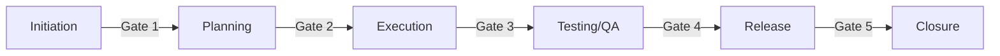

# Governance & PMO

> Principles for project governance, oversight, and strategic decision-making.

---

## When to Use

- Project initiation (charter creation)
- Phase gate reviews
- Go/No-Go decisions
- Portfolio-level prioritization
- Governance framework setup

---

## Project Charter Template

```markdown
## Project Charter — [Project Name]

### Overview

| Field           | Value     |
| --------------- | --------- |
| Project Name    | [name]    |
| Sponsor         | @name     |
| Project Manager | @name     |
| Start Date      | [date]    |
| Target End Date | [date]    |
| Budget          | €[amount] |

### Business Case

[Why this project exists — problem statement, opportunity, expected value]

### Objectives

1. [Measurable objective 1]
2. [Measurable objective 2]

### Scope Summary

- **In Scope:** [key deliverables]
- **Out of Scope:** [explicit exclusions]

### Success Criteria

| Criterion   | Measure  | Target  |
| ----------- | -------- | :-----: |
| [criterion] | [metric] | [value] |

### Key Stakeholders

| Name  | Role          | Interest Level |
| ----- | ------------- | :------------: |
| @name | Sponsor       |      High      |
| @name | Product Owner |      High      |

### Key Risks

| Risk   | Impact | Mitigation |
| ------ | :----: | ---------- |
| [risk] |   🟡   | [action]   |

### Approvals

| Name  | Role    | Signature  | Date     |
| ----- | ------- | ---------- | -------- |
| @name | Sponsor | ****\_**** | \_\_\_\_ |
```

---

## Stage Gate Framework



### Gate Criteria

| Gate | Decision Point       | Key Questions                                         |
| ---- | -------------------- | ----------------------------------------------------- |
| G1   | Proceed to planning? | Business case valid? Sponsor committed?               |
| G2   | Proceed to build?    | Plan approved? Resources available? Risks acceptable? |
| G3   | Proceed to test?     | Features complete? Quality standards met?             |
| G4   | Proceed to release?  | Testing passed? Go/no-go criteria met?                |
| G5   | Close project?       | All deliverables accepted? Lessons captured?          |

### Gate Review Output

```markdown
## Gate [N] Review — [Project Name]

**Date:** [date]
**Gate:** [name]
**Decision:** ✅ Go / ❌ No-Go / ⏸️ Conditional Go

### Status by Dimension

| Dimension | Status | Notes   |
| --------- | :----: | ------- |
| Scope     |   🟢   | [notes] |
| Schedule  |   🟡   | [notes] |
| Budget    |   🟢   | [notes] |
| Quality   |   🟢   | [notes] |
| Risk      |   🟡   | [notes] |

### Conditions (if Conditional Go)

- [ ] [condition 1] — Due: [date]
- [ ] [condition 2] — Due: [date]

### Attendees

| Name  | Role      | Vote |
| ----- | --------- | :--: |
| @name | Sponsor   |  ✅  |
| @name | PM        |  ✅  |
| @name | Tech Lead |  ⏸️  |
```

---

## Go/No-Go Decision Framework

### Criteria Template

```markdown
## Go/No-Go — [Decision Point]

| #   | Criterion                  |  Weight  | Status | Score |
| --- | -------------------------- | :------: | :----: | :---: |
| 1   | All P0/P1 defects resolved |   High   |   ✅   |  3/3  |
| 2   | Performance benchmarks met |   High   |   ✅   |  3/3  |
| 3   | Security scan passed       | Critical |   ✅   |  3/3  |
| 4   | Documentation complete     |  Medium  |   ⚠️   |  2/3  |
| 5   | Rollback plan tested       |   High   |   ✅   |  3/3  |
| 6   | Stakeholder sign-off       |   High   |   ✅   |  3/3  |

**Total Score:** 17/18
**Decision:** ✅ Go (with condition: complete docs by [date])
```

### Voting Rules

- **Critical criteria:** All must pass (single veto)
- **High criteria:** ≥80% must pass
- **Medium criteria:** Best effort, can proceed with conditions

---

## Portfolio View

For managing multiple projects:

```markdown
## Portfolio Dashboard

| Project   | Status | Phase     | Budget | Schedule | Team | Priority |
| --------- | :----: | --------- | :----: | :------: | :--: | :------: |
| Project A |   🟢   | Execution |   🟢   |    🟢    |  5   |    P1    |
| Project B |   🟡   | Planning  |   🟢   |    🟡    |  3   |    P2    |
| Project C |   🔴   | Testing   |   🔴   |    🔴    |  4   |    P1    |
```

---

## Project Closure Checklist

- [ ] All deliverables accepted by stakeholder
- [ ] Final budget reconciliation
- [ ] Lessons learned captured
- [ ] Documentation archived
- [ ] Resources released
- [ ] Post-implementation review scheduled
- [ ] Final status report issued

---

## Anti-Patterns

- ❌ No project charter (no shared understanding)
- ❌ Skipping gate reviews ("we're agile")
- ❌ Gates without decision authority
- ❌ No portfolio-level prioritization
- ❌ Never formally closing projects
