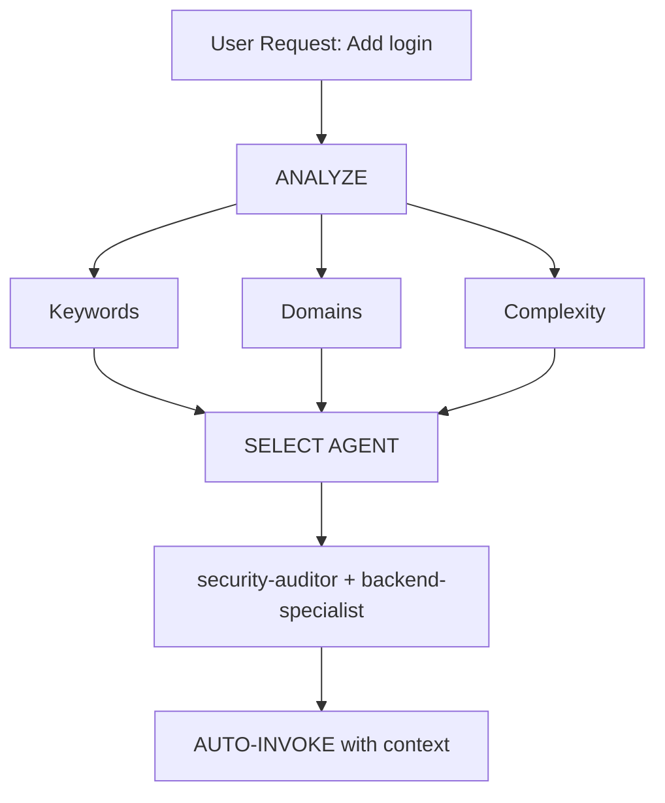

# Intelligent Agent Routing

**Purpose**: Automatically analyze user requests and route them to the most appropriate specialist agent(s) without requiring explicit user mentions.

> 🔴 **Agent Registry & Routing Matrix**: All agent definitions, keywords, and boundary rules are defined in `.agent/rules/AGENTS.md` and `AGENTS-*-kit.md` files. This skill defines the **runtime logic** — how to analyze, select, and invoke agents. It does NOT duplicate the registry.

## Core Principle

> **The AI should act as an intelligent Project Manager**, analyzing each request and automatically selecting the best specialist(s) for the job.

## How It Works

### 1. Request Analysis

Before responding to ANY user request, perform automatic analysis:



### 2. Agent Selection

**Consult `AGENTS.md` routing matrix to select agents.** The matrix maps domains and keywords to the correct specialist(s).

### 3. Automatic Routing Protocol

Before responding to ANY request:

```javascript
// Pseudo-code for decision tree
function analyzeRequest(userMessage) {
    // 1. Classify request type
    const requestType = classifyRequest(userMessage);

    // 2. Detect domains (match keywords from AGENTS.md routing matrix)
    const domains = detectDomains(userMessage);

    // 3. Determine complexity
    const complexity = assessComplexity(domains);

    // 4. Select agent(s)
    if (complexity === "SIMPLE" && domains.length === 1) {
        return selectSingleAgent(domains[0]);
    } else if (complexity === "MODERATE" && domains.length <= 2) {
        return selectMultipleAgents(domains);
    } else {
        return "orchestrator"; // Complex task
    }
}
```

### 4. Response Format

**When auto-selecting an agent, inform the user concisely:**

```markdown
🤖 **Applying knowledge of `@security-auditor` + `@backend-specialist`...**

[Proceed with specialized response]
```

**Benefits:**

- ✅ User sees which expertise is being applied
- ✅ Transparent decision-making
- ✅ Still automatic (no /commands needed)

---

## Complexity Assessment

### SIMPLE (Direct agent invocation)

- Single file edit
- Clear, specific task
- One domain only
- Example: "Fix the login button style"

**Action**: Auto-invoke respective agent

### MODERATE (2-3 agents)

- 2-3 files affected
- Clear requirements
- 2 domains max
- Example: "Add API endpoint for user profile"

**Action**: Auto-invoke relevant agents sequentially

### COMPLEX (Orchestrator required)

- Multiple files/domains
- Architectural decisions needed
- Unclear requirements
- Example: "Build a social media app"

**Action**: Auto-invoke `orchestrator` → will ask Socratic questions

---

## Implementation Rules

### Rule 1: Silent Analysis

#### DO NOT announce "I'm analyzing your request..."

- ✅ Analyze silently
- ✅ Inform which agent is being applied
- ❌ Avoid verbose meta-commentary

### Rule 2: Inform Agent Selection

**DO inform which expertise is being applied:**

```markdown
🤖 **Applying knowledge of `@frontend-specialist`...**

I will create the component with the following characteristics:
[Continue with specialized response]
```

### Rule 3: Seamless Experience

**The user should not notice a difference from talking to the right specialist directly.**

### Rule 4: Override Capability

**User can still explicitly mention agents:**

```text
User: "Use @backend-specialist to review this"
→ Override auto-selection
→ Use explicitly mentioned agent
```

---

## Edge Cases

### Case 1: Generic Question

```text
User: "How does React work?"
→ Type: QUESTION
→ No agent needed
→ Respond directly with explanation
```

### Case 2: Extremely Vague Request

```text
User: "Make it better"
→ Complexity: UNCLEAR
→ Action: Ask clarifying questions first
→ Then route to appropriate agent
```

### Case 3: Contradictory Patterns

```text
User: "Add mobile support to the web app"
→ Conflict: mobile vs web
→ Action: Ask: "Do you want responsive web or native mobile app?"
→ Then route accordingly
```

---

## Integration with Existing Rules

### With /orchestrate Command

- **User types `/orchestrate`**: Explicit orchestration mode
- **AI detects complex task**: Auto-invoke orchestrator (same result)

**Difference**: User doesn't need to know the command exists.

### With Socratic Gate

- **Auto-routing does NOT bypass Socratic Gate**
- If task is unclear, still ask questions first
- Then route to appropriate agent

### With CORE.md + AGENTS.md Rules

- **Priority**: CORE.md + AGENTS.md rules > intelligent-routing
- If AGENTS.md specifies explicit routing, follow it
- Intelligent routing is the DEFAULT when no explicit rule exists

---

## Summary

**intelligent-routing skill enables:**

✅ Zero-command operation (no need for `/orchestrate`)
✅ Automatic specialist selection based on request analysis
✅ Transparent communication of which expertise is being applied
✅ Seamless integration with existing workflows
✅ Override capability for explicit agent mentions
✅ Fallback to orchestrator for complex tasks

**Result**: User gets specialist-level responses without needing to know the system architecture.
