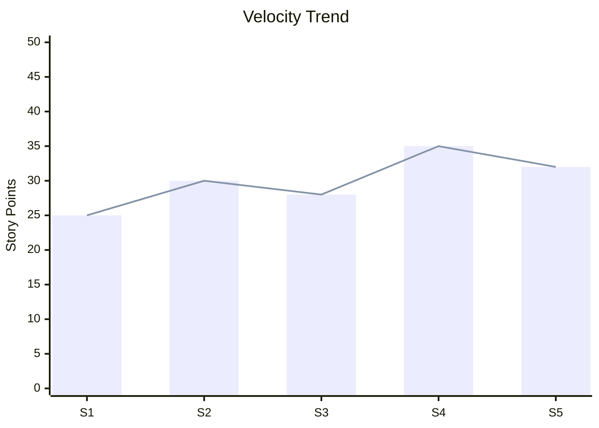
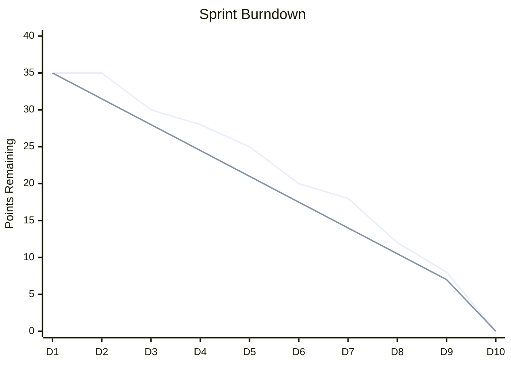

# Metrics & Analytics

> Principles for measuring, visualizing, and acting on project data.

---

## When to Use

- Sprint review (velocity, burndown)
- Project health assessment
- Stakeholder reporting
- Process improvement decisions
- Forecasting delivery dates

---

## Core Principle

> **Measure to improve, not to punish.** Metrics are team tools, not management weapons.

---

## Key Metrics

### 1. Velocity

**What:** Story points completed per sprint
**Use:** Sprint planning, forecasting



**Rules:**

- Use rolling average (3-5 sprints)
- Never compare across teams
- Investigate significant drops or spikes

### 2. Burndown Chart

**What:** Remaining work vs time in sprint
**Use:** Sprint health, early warning



**Reading the chart:**

- Above ideal line → Behind schedule
- Below ideal line → Ahead
- Flat line → Blocked work
- Sudden drop → Large item completed late

### 3. Cumulative Flow Diagram (CFD)

**What:** Work items in each state over time
**Use:** Bottleneck detection, WIP monitoring

**Reading the CFD:**

- Widening band → Bottleneck in that state
- Narrowing band → Draining faster than filling
- Parallel bands → Stable flow
- Converging bands → Work completing, nothing new entering

### 4. Lead Time & Cycle Time

| Metric         | Definition                          | Measured From → To      |
| -------------- | ----------------------------------- | ----------------------- |
| **Lead Time**  | Total time from request to delivery | Backlog creation → Done |
| **Cycle Time** | Time actively worked on             | In Progress → Done      |

**Target:** Minimize both, but focus on **cycle time** (you control it).

### 5. Throughput

**What:** Number of items completed per time period
**Use:** Alternative to velocity (more stable for Kanban)

### 6. WIP (Work In Progress)

**What:** Items currently in "In Progress" state
**Rule:** WIP limit = team size × 1.5 (starting point, adjust)

**Little's Law:**

```
Avg Cycle Time = WIP / Throughput
```

→ Reducing WIP reduces cycle time.

---

## Sprint Metrics Dashboard Template

```markdown
## Sprint [N] Metrics

| Metric          |     Value      |     Trend     |
| --------------- | :------------: | :-----------: |
| Velocity        |     32 pts     |     📈 +3     |
| Commitment      |     35 pts     |       —       |
| Completion Rate |      91%       |      📈       |
| Carryover       | 1 item (3 pts) |      📉       |
| Avg Cycle Time  |    2.1 days    |      📉       |
| WIP Peak        |       8        | ⚠️ Over limit |
| Blockers        |  2 (resolved)  |      ✅       |
| Scope Changes   |       0        |      ✅       |

### Burndown

[Mermaid chart]

### Velocity Trend (Last 5 Sprints)

[Mermaid chart]
```

---

## Project-Level Metrics

| Metric                 | Cadence    | Audience            |
| ---------------------- | ---------- | ------------------- |
| Velocity Trend         | Per sprint | Team, SM            |
| Release Burndown       | Weekly     | PM, Stakeholders    |
| Defect Rate            | Per sprint | QA, Team            |
| Estimation Accuracy    | Per sprint | Team (improvement)  |
| Lead Time Distribution | Monthly    | Process improvement |

### Estimation Accuracy

```
Accuracy = (Estimated Points / Actual Points) × 100%

Target: 80-120% range
```

Track per-sprint to improve calibration.

---

## When to Act

| Signal                       | Action                                         |
| ---------------------------- | ---------------------------------------------- |
| Velocity dropping 2+ sprints | Investigate: scope changes? blockers? burnout? |
| Cycle time increasing        | Check WIP limits, identify bottleneck          |
| High carryover (>20%)        | Stories too large? Dependencies?               |
| Flat burndown mid-sprint     | Blocked items? Waiting for review?             |
| WIP consistently over limit  | Enforce limits, swarm on items                 |

---

## Anti-Patterns

- ❌ Using velocity to compare teams
- ❌ Setting velocity targets ("do 40 points next sprint")
- ❌ Metrics without context (numbers need narrative)
- ❌ Measuring everything (focus on 3-5 key metrics)
- ❌ Vanity metrics (lines of code, commits per day)
- ❌ Ignoring trends (a single data point means nothing)
