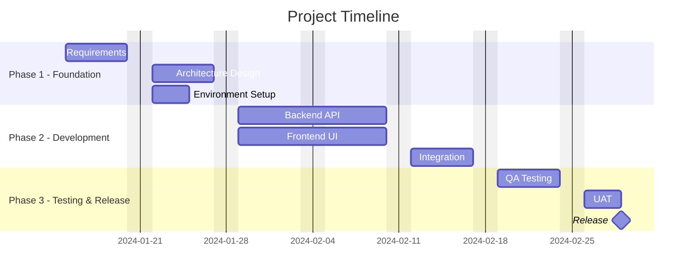

# Project Scheduling

> Principles for creating, managing, and optimizing project timelines.

---

## When to Use

- Project planning (timeline creation)
- Milestone definition
- Dependency mapping
- Schedule risk assessment
- Stakeholder timeline communication

---

## Work Breakdown Structure (WBS)

Break work into manageable deliverables before scheduling:

```markdown
## WBS — [Project Name]

1. **[Phase/Deliverable 1]**
   1.1 [Work Package]
   1.2 [Work Package]
2. **[Phase/Deliverable 2]**
   2.1 [Work Package]
   2.2 [Work Package]
   2.3 [Work Package]
3. **[Phase/Deliverable 3]**
   3.1 [Work Package]
```

**Rule:** Decompose until each work package is estimable (2-10 days effort).

---

## Gantt Chart (Mermaid)



---

## Critical Path Analysis

The **critical path** is the longest sequence of dependent tasks. Any delay on this path delays the project.

### Identifying Critical Path

1. List all tasks with durations and dependencies
2. Calculate earliest start/finish (forward pass)
3. Calculate latest start/finish (backward pass)
4. **Float = Latest Start - Earliest Start**
5. Tasks with **zero float** = critical path

### Critical Path Template

```markdown
## Critical Path — [Project Name]

| Task | Duration | Dependencies | ES  | EF  | LS  | LF  | Float | Critical? |
| ---- | :------: | ------------ | :-: | :-: | :-: | :-: | :---: | :-------: |
| A    |    5d    | —            |  0  |  5  |  0  |  5  |   0   |    ✅     |
| B    |    3d    | —            |  0  |  3  |  2  |  5  |   2   |     —     |
| C    |   10d    | A            |  5  | 15  |  5  | 15  |   0   |    ✅     |
| D    |   10d    | A            |  5  | 15  |  5  | 15  |   0   |    ✅     |
| E    |    5d    | C,D          | 15  | 20  | 15  | 20  |   0   |    ✅     |

**Critical Path:** A → C → E (or A → D → E)
**Project Duration:** 20 days
```

---

## Schedule Compression

When the deadline is earlier than the schedule allows:

| Technique           | How                                  | Risk |  Cost   |
| ------------------- | ------------------------------------ | :--: | :-----: |
| **Crashing**        | Add resources to critical path tasks |  🟡  | 🔴 High |
| **Fast-Tracking**   | Run sequential tasks in parallel     |  🔴  | 🟢 Low  |
| **Scope Reduction** | Remove non-critical features         |  🟡  | 🟢 Low  |
| **Timebox**         | Fixed time, flexible scope           |  🟡  | 🟢 Low  |

### Decision Guide

```
Schedule too long?
├── Can tasks overlap? → Fast-track (introduce risk)
├── Can we add people? → Crash (increase cost)
├── Can we cut scope? → Negotiate with PO
└── None work? → Negotiate deadline with sponsor
```

---

## Milestone Planning

```markdown
## Milestones — [Project Name]

| #   | Milestone             | Target Date | Criteria                        | Status |
| --- | --------------------- | :---------: | ------------------------------- | :----: |
| M1  | Requirements Complete | 2024-01-20  | All stories in backlog, DoR met |   🟢   |
| M2  | MVP Ready             | 2024-02-15  | Core features working           |   🟡   |
| M3  | Beta Release          | 2024-03-01  | UAT complete                    |   ⚪   |
| M4  | GA Release            | 2024-03-15  | Go/no-go passed                 |   ⚪   |
```

---

## Dependency Types

| Type                  | Notation | Meaning                         |
| --------------------- | -------- | ------------------------------- |
| Finish-to-Start (FS)  | A → B    | B starts after A finishes       |
| Start-to-Start (SS)   | A ↔ B    | B starts when A starts          |
| Finish-to-Finish (FF) | A ⇒ B    | B finishes when A finishes      |
| Start-to-Finish (SF)  | A ⇔ B    | B finishes when A starts (rare) |

Default: **FS** (most common, safest).

---

## Schedule Risk Buffer

Add buffers based on risk level:

| Risk Level | Buffer  |
| :--------: | :-----: |
|   🟢 Low   |  +10%   |
| 🟡 Medium  | +15-20% |
|  🔴 High   | +25-30% |

Place buffer at **end of critical path**, not on each task.

---

## Anti-Patterns

- ❌ No critical path identification
- ❌ Padding every task instead of project-level buffer
- ❌ No dependency mapping ("everything in parallel")
- ❌ Timeline without milestones
- ❌ Ignoring resource constraints in scheduling
- ❌ Not updating the schedule when reality changes
