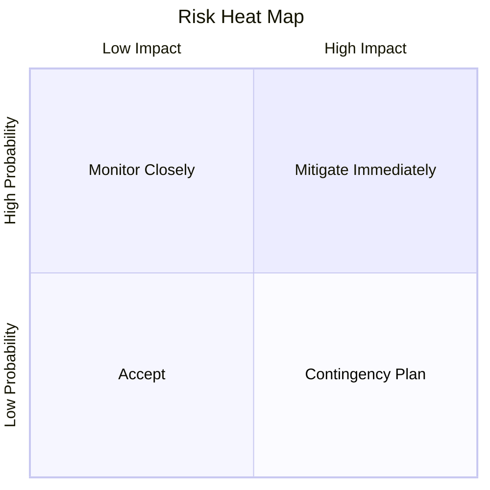

# Risk Management

> Principles for identifying, assessing, and mitigating project risks.

---

## When to Use

- Starting a new project or phase
- Before major architectural decisions
- When stakeholders ask "what could go wrong?"
- During sprint planning to flag blockers
- Post-incident to update risk posture

---

## Risk Identification

### Techniques

1. **Brainstorming** — Team-wide risk surfacing
2. **Checklist Review** — Common risk categories:
    - Technical (architecture, dependencies, performance)
    - Schedule (estimation errors, resource availability)
    - Scope (creep, unclear requirements)
    - External (vendors, regulations, market)
    - Organizational (team changes, budget cuts)
3. **Assumption Analysis** — Challenge every assumption
4. **SWOT** — Strengths, Weaknesses, Opportunities, Threats

### Risk Categories (IT-specific)

| Category        | Examples                                               |
| --------------- | ------------------------------------------------------ |
| **Technical**   | Unproven tech, integration complexity, scalability     |
| **Security**    | Data breach, compliance gaps, access control           |
| **Operational** | Deployment failure, monitoring gaps, incident response |
| **People**      | Key person dependency, skill gaps, turnover            |
| **External**    | Vendor lock-in, API deprecation, regulatory change     |

---

## Risk Assessment

### Probability × Impact Matrix

Rate each risk on two dimensions (1-5):

```
Impact →     1-Negligible  2-Minor  3-Moderate  4-Major  5-Critical
Probability ↓
5-Almost Certain   5          10        15         20        25
4-Likely           4           8        12         16        20
3-Possible         3           6         9         12        15
2-Unlikely         2           4         6          8        10
1-Rare             1           2         3          4         5
```

**Risk Score = Probability × Impact**

| Score | Level       | Action                        |
| ----- | ----------- | ----------------------------- |
| 15-25 | 🔴 Critical | Immediate mitigation required |
| 8-14  | 🟡 High     | Mitigation plan within sprint |
| 4-7   | 🟠 Medium   | Monitor, plan if escalates    |
| 1-3   | 🟢 Low      | Accept and monitor            |

### Mermaid Heat Map Template



---

## Risk Response Strategies

| Strategy     | When to Use                    | Example                              |
| ------------ | ------------------------------ | ------------------------------------ |
| **Avoid**    | Eliminate the threat entirely  | Choose proven tech over experimental |
| **Mitigate** | Reduce probability or impact   | Add automated tests, redundancy      |
| **Transfer** | Shift risk to third party      | Insurance, SLA with vendor           |
| **Accept**   | Cost of response > risk impact | Minor UI inconsistency               |
| **Escalate** | Beyond team's control          | Budget decision needed from sponsor  |

---

## Risk Register Template

```markdown
## Risk Register — [Project Name]

| ID  | Risk          | Category  | Probability | Impact | Score | Strategy | Mitigation | Owner | Status     |
| --- | ------------- | --------- | :---------: | :----: | :---: | -------- | ---------- | ----- | ---------- |
| R1  | [description] | Technical |      4      |   5    | 20 🔴 | Mitigate | [action]   | @name | Open       |
| R2  | [description] | Schedule  |      3      |   3    | 9 🟡  | Accept   | [action]   | @name | Monitoring |
```

### Review Cadence

- **🔴 Critical risks**: Review every standup
- **🟡 High risks**: Review weekly
- **🟠 Medium risks**: Review bi-weekly
- **🟢 Low risks**: Review monthly

---

## Integration with Other Skills

| Skill                   | Integration Point                      |
| ----------------------- | -------------------------------------- |
| `sprint-management`     | Flag risks during sprint planning      |
| `estimation-techniques` | Risk-adjusted estimates (three-point)  |
| `pm-reporting`          | Include risk summary in status reports |
| `change-management`     | Assess risks of change requests        |
| `project-scheduling`    | Risk buffer in timeline                |

---

## Anti-Patterns

- ❌ Creating risk register once and never updating
- ❌ Listing risks without owners or actions
- ❌ Treating all risks equally (no scoring)
- ❌ Only identifying technical risks (ignoring people, process)
- ❌ Risk theater — documenting for compliance without real analysis
