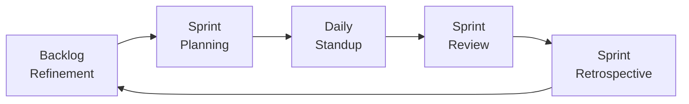

# Sprint Management

> Principles for planning, executing, and closing agile sprints.

---

## When to Use

- Starting a new sprint
- Mid-sprint health check
- Sprint review or demo preparation
- Deciding sprint length or capacity
- Managing work-in-progress during sprints

---

## Sprint Lifecycle



---

## Sprint Planning

### Inputs

1. **Prioritized backlog** (from Product Owner)
2. **Team capacity** (calculated below)
3. **Velocity** (last 3 sprint average)
4. **Sprint goal** (one clear objective)

### Capacity Calculation

```
Available Hours = Team Members × Sprint Days × Hours/Day × Focus Factor

Focus Factor:
- New team: 0.6
- Established team: 0.7
- Mature team: 0.8
```

**Example:**

```
5 devs × 10 days × 6 hrs/day × 0.7 = 210 available hours
Historical velocity: 35 points → ~6 hrs/point
Sprint capacity: ~35 points
```

### Sprint Goal

The sprint goal is a **single sentence** answering: _"What is the most important thing we deliver this sprint?"_

**Good:** "Users can complete checkout with credit card payment"
**Bad:** "Complete tasks 42, 43, 44, 45, 46" (that's a list, not a goal)

### Definition of Ready (DoR)

A story is ready for sprint when:

- [ ] Acceptance criteria are clear and testable
- [ ] Dependencies are identified and resolved (or planned)
- [ ] Estimated by the team
- [ ] Small enough to complete in one sprint
- [ ] No open questions blocking implementation

### Definition of Done (DoD)

A story is done when:

- [ ] Code complete and peer-reviewed
- [ ] Unit tests pass (coverage meets standard)
- [ ] Integration tests pass
- [ ] Documentation updated (if applicable)
- [ ] Deployed to staging/preview environment
- [ ] Product Owner accepts the result

---

## Daily Standup

### Format (max 15 minutes)

Each team member answers:

1. **What did I complete since last standup?**
2. **What will I work on next?**
3. **Any blockers or risks?**

### Standup Output Template

```markdown
## Daily Standup — [Date]

### 🟢 Completed

- [item] (@person)

### 🔵 In Progress

- [item] (@person) — ETA: [date]

### 🔴 Blocked

- [item] (@person) — Blocker: [description]
    - Action: [who will resolve, by when]

### Sprint Health

- Days remaining: X/Y
- Points completed: X/Z (X%)
- On track: ✅/⚠️/❌
```

---

## Sprint Board States

| Column          | Meaning                          | WIP Limit |
| --------------- | -------------------------------- | :-------: |
| **To Do**       | Selected for sprint, not started |     —     |
| **In Progress** | Actively being worked on         | 2 per dev |
| **In Review**   | Code review or QA                |  3 total  |
| **Done**        | Meets DoD                        |     —     |

### WIP Rules

- **Pull, don't push** — Take new work only when capacity frees up
- **Finish before starting** — Complete in-progress items first
- **Swarm on blockers** — Team helps unblock before taking new work

---

## Sprint Review / Demo

### Structure (max 60 min)

1. **Sprint Goal recap** (2 min)
2. **Demo of completed work** (30 min)
3. **Metrics review** — velocity, burndown (5 min)
4. **Stakeholder feedback** (15 min)
5. **Next sprint preview** (5 min)

### Demo Tips

- Show **working software**, not slides
- Demo from the **user's perspective**
- Note feedback as **backlog candidates**, don't commit on the spot

---

## Sprint Health Indicators

| Indicator | 🟢 Healthy          | ⚠️ Warning          | 🔴 Critical               |
| --------- | ------------------- | ------------------- | ------------------------- |
| Burndown  | On/below ideal line | Slightly above      | Flat or increasing        |
| Scope     | No changes          | Minor additions     | Items added mid-sprint    |
| Blockers  | 0                   | 1-2, being resolved | 3+ or unresolved >2 days  |
| WIP       | Within limits       | Slightly over       | Significantly over limits |
| Goal      | Achievable          | At risk             | Unreachable               |

---

## Sprint Close Checklist

- [ ] All "Done" items meet DoD
- [ ] Incomplete items returned to backlog (re-prioritize)
- [ ] Velocity recorded
- [ ] Sprint review conducted
- [ ] Retrospective scheduled/conducted
- [ ] Metrics updated (burndown, velocity chart)

---

## Integration with Other Skills

| Skill                   | Integration Point                         |
| ----------------------- | ----------------------------------------- |
| `estimation-techniques` | Sizing during planning, velocity tracking |
| `metrics-analytics`     | Burndown, velocity, CFD generation        |
| `retrospective`         | Sprint retro after review                 |
| `meeting-facilitation`  | Standup and planning facilitation         |
| `risk-management`       | Flag risks during planning and standups   |

---

## Anti-Patterns

- ❌ Sprint planning without a sprint goal
- ❌ Changing scope mid-sprint without team agreement
- ❌ Skipping retrospectives
- ❌ Treating velocity as a performance metric
- ❌ Sprint length changes every iteration
- ❌ No WIP limits (everything "in progress")
- ❌ Standup becomes a status report to the manager
