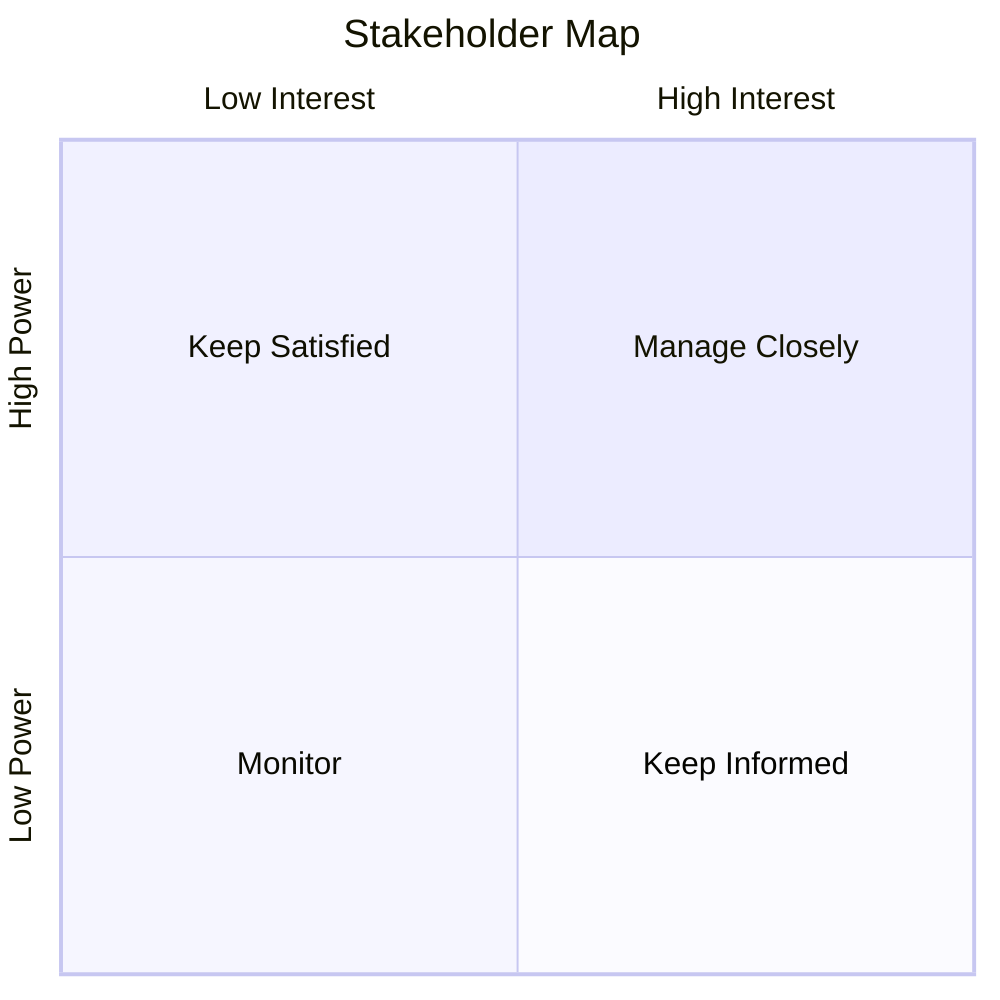

# Stakeholder Management

> Principles for identifying, analyzing, and engaging project stakeholders.

---

## When to Use

- Project kickoff
- Communication planning
- Escalation or conflict resolution
- Responsibility assignment
- Stakeholder register creation

---

## Stakeholder Identification

### Categories

| Category            | Examples                          |
| ------------------- | --------------------------------- |
| **Sponsor**         | Budget owner, executive champion  |
| **Decision Makers** | Steering committee, product owner |
| **Contributors**    | Dev team, QA, design              |
| **Affected**        | End users, support, operations    |
| **External**        | Vendors, regulators, partners     |

---

## Power/Interest Grid



| Quadrant                      | Strategy                                              |
| ----------------------------- | ----------------------------------------------------- |
| **High Power, High Interest** | Manage closely — Regular 1:1, involve in decisions    |
| **High Power, Low Interest**  | Keep satisfied — Executive summaries, escalate issues |
| **Low Power, High Interest**  | Keep informed — Weekly updates, demos                 |
| **Low Power, Low Interest**   | Monitor — Include in broadcasts only                  |

---

## RACI Matrix

| Deliverable     | PM  | PO  | Dev Lead | QA  | DevOps | Sponsor |
| --------------- | :-: | :-: | :------: | :-: | :----: | :-----: |
| Requirements    |  C  |  R  |    C     |  I  |   I    |    A    |
| Architecture    |  I  |  C  |    R     |  I  |   C    |    A    |
| Sprint Planning |  I  |  A  |    R     |  C  |   I    |    I    |
| Testing         |  I  |  A  |    C     |  R  |   I    |    I    |
| Deployment      |  I  |  I  |    C     |  C  |   R    |    A    |
| Status Report   |  R  |  C  |    C     |  I  |   I    |    A    |

**Legend:**

- **R** = Responsible (does the work)
- **A** = Accountable (approves/owns)
- **C** = Consulted (provides input)
- **I** = Informed (notified of results)

**Rules:**

- Every row has exactly **one A**
- Every row has at least **one R**
- Minimize C's (too many = bottleneck)

---

## Communication Plan Template

```markdown
| Stakeholder   | Info Need             | Channel        | Frequency   | Owner     |
| ------------- | --------------------- | -------------- | ----------- | --------- |
| Sponsor       | Project status, risks | Steering deck  | Bi-weekly   | PM        |
| Product Owner | Sprint progress       | Sprint review  | Per sprint  | SM        |
| Dev Team      | Technical decisions   | Standup, Slack | Daily       | Tech Lead |
| End Users     | Feature releases      | Release notes  | Per release | PM        |
| Support       | Known issues          | Wiki           | As needed   | QA        |
```

---

## Escalation Path

```
Team Level → Scrum Master → Project Manager → Sponsor → Steering Committee
```

| Level    | Timeout | Decision Type             |
| -------- | ------- | ------------------------- |
| Team     | 1 day   | Technical, within sprint  |
| SM/PM    | 2 days  | Process, inter-team       |
| Sponsor  | 1 week  | Budget, scope, timeline   |
| Steering | 2 weeks | Strategic, organizational |

---

## Anti-Patterns

- ❌ No stakeholder map (flying blind)
- ❌ Same communication for all stakeholders
- ❌ RACI with multiple Accountables per item
- ❌ Ignoring low-power stakeholders entirely
- ❌ Escalating everything instead of resolving at team level
